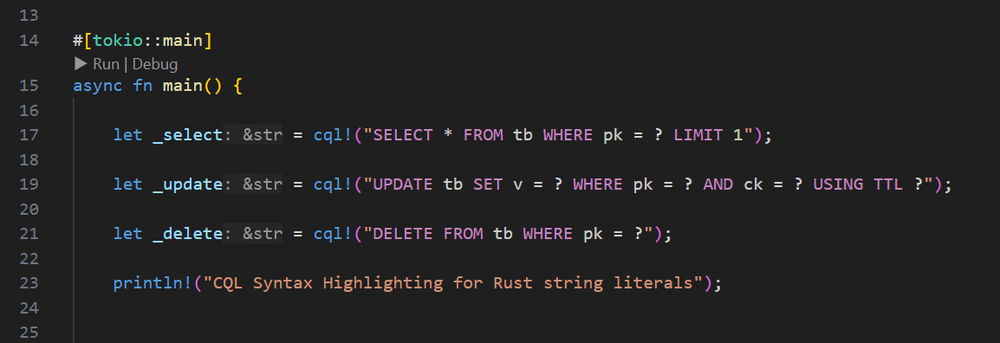

# CQL Syntax for Rust
Rustの`cql!`マクロ内の文字列リテラルのみにCQLシンタックスハイライトを適用します。<br>
Applies CQL syntax highlighting only to string literals inside Rust's `cql!` macro.

```rust
macro_rules! cql {
    ($stmt:expr) => {
        $stmt
    };
}
```



### 制限 (Limitation)
使用するためにVSCodeで以下の設定が必要です。
The following settings are required in VSCode in order to use it.
```json
{
    "rust-analyzer.highlighting.strings": false
}
```